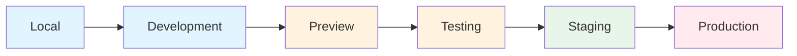
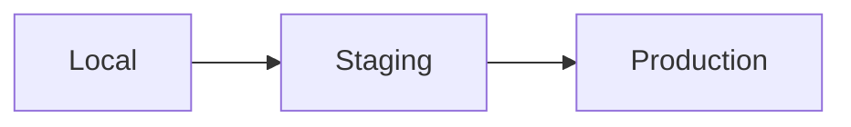
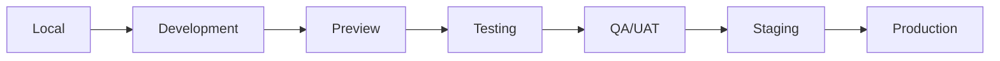
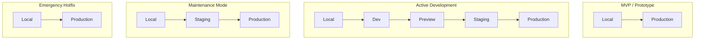

# Environment Stages

This document provides guidance on development environment stages throughout the software development lifecycle. It covers environment definitions, when to use each, and multiple approaches based on project needs.

For branch workflows that integrate with these environments, see [PROCESS_WORKFLOW.md](PROCESS_WORKFLOW.md).

## Overview

Environment separation follows the DTAP model (Development, Testing, Acceptance, Production), which minimizes risk by isolating changes at each stage before advancing to the next. Not every project needs all environments — the right setup depends on team size, budget, compliance requirements, and project phase.



*Not all stages are required for every project. See [Environment Approaches](#environment-approaches) for different configurations.*

---

## Environment Definitions

| Environment | Purpose | Data | Primary Users | Risk Level |
|-------------|---------|------|---------------|------------|
| **Local** | Coding & debugging | Mock/seed data | Individual developer | None |
| **Development** | Integration & shared work | Test data | Development team | Low |
| **Preview** | PR-based feature review | Branch/test data | Reviewers, stakeholders | Low |
| **Testing/QA** | Validation & regression | Controlled test data | QA team | Medium |
| **Staging** | Production mirror, UAT | Anonymized prod copy | Stakeholders, UAT | Medium |
| **Production** | Live service | Real user data | End users | High |

### Local Environment

The developer's personal workspace for writing, debugging, and testing code before sharing with the team.

**Characteristics:**
- Runs on the developer's machine without external hosting
- Uses mock data, local databases, or seed data
- Fast feedback loops for rapid iteration
- May use containerized setups for consistency across team members

**Best for:** Initial development, debugging, experimentation, running unit tests.

### Development Environment

A shared environment where the team integrates their work and verifies that components work together.

**Characteristics:**
- Shared server accessible to the development team
- Uses test data that may be periodically refreshed
- May connect to sandbox versions of third-party services
- Less stable than staging — frequent deployments expected

**Best for:** Integration testing, shared feature development, early bug detection.

### Preview Environment

Temporary, ephemeral environments automatically created for pull requests or feature branches.

**Characteristics:**
- Automatically provisioned when a PR is opened
- Automatically destroyed when the PR is merged or closed
- Each PR gets a unique URL for review
- Mimics production or staging configuration

**Best for:** Code review with live preview, stakeholder feedback on specific features, testing changes in isolation before merge.

**Considerations:**
- Resource constraints — running many preview environments simultaneously can be costly
- Database strategy — may use branch copies, shared test DB, or isolated instances
- Should align with branch naming conventions (see [PROCESS_WORKFLOW.md](PROCESS_WORKFLOW.md))

### Testing/QA Environment

A stable, controlled environment dedicated to structured testing and quality assurance.

**Characteristics:**
- Isolated from development churn
- Controlled test data that can be reset to known states
- Supports automated test suites and manual testing
- May have multiple instances for parallel testing streams

**Best for:** Regression testing, automated test suites, structured QA processes, security testing.

**When multiple testing environments are needed:**
- Parallel development streams with different release schedules
- Long-running test suites that would block other testing
- Client-specific configurations requiring separate validation
- Compliance testing requiring isolated environments

### Staging Environment

A near-exact replica of production for final validation before release.

**Characteristics:**
- Mirrors production infrastructure as closely as possible
- Uses anonymized/sanitized copies of production data
- Connects to sandbox versions of third-party APIs
- Supports User Acceptance Testing (UAT)
- May be used for performance and load testing

**Best for:** Final pre-release validation, UAT, deployment pipeline testing, performance testing.

### Production Environment

The live environment serving real users with real data.

**Characteristics:**
- Handles actual user data and transactions
- Requires strict access controls and monitoring
- Changes should go through all prior stages first
- Needs backup, disaster recovery, and rollback capabilities

**Best for:** Serving end users. All testing should be completed before deployment here.

---

## Environment Approaches

Choose an approach based on your project's needs. These are guidelines, not strict rules.

### Approach A: Minimal Pipeline



**When to use:**
- MVPs and prototypes
- Limited infrastructure budget
- Small teams (1-3 developers)
- Rapid iteration is more important than stability
- Internal tools with limited user base

**Trade-offs:**
- Lower infrastructure cost
- Faster deployment cycles
- Higher risk — less validation before production
- Less isolation between development and testing

**Skipped environments:** Development, Preview, Testing

### Approach B: Standard Pipeline

```mermaid
flowchart LR
    Local --> Dev[Development] --> Feature Preview --> Staging --> Production
    OR
    Local --> Development Preview --> Dev[Development]  --> Staging --> Production
```

**When to use:**
- Most production applications
- Medium-sized teams (4-10 developers)
- Regular release cycles (weekly/bi-weekly)
- External-facing applications with moderate risk tolerance

**Aligns with:** [Workflow 1](PROCESS_WORKFLOW.md#workflow-1) (simple projects without develop branch)

**Trade-offs:**
- Balanced cost and risk mitigation
- Preview environments enable collaborative review
- Testing happens on Development and Staging
- May not be sufficient for regulated industries

**Skipped environments:** Dedicated Testing/QA environment (testing on Dev/Staging)

### Approach C: Full Pipeline (DTAP+)



**When to use:**
- Enterprise applications
- Regulated industries (healthcare, finance)
- Large teams (10+ developers)
- Complex integrations with multiple third-party services
- Applications where bugs have significant business impact

**Aligns with:** [Workflow 2](PROCESS_WORKFLOW.md#workflow-2) (stable projects with develop branch)

**Trade-offs:**
- Higher infrastructure and maintenance costs
- Longer deployment pipelines
- Maximum validation and risk mitigation
- Clear separation of concerns for different testing types

---

## Testing Strategy by Environment

| Testing Type | Where to Run | When | Can Skip If... |
|--------------|--------------|------|----------------|
| **Unit tests** | Local, CI | Every commit | Never — always required |
| **Integration tests** | Development, Testing | Feature completion | Very small, isolated changes |
| **End-to-End (E2E)** | Staging | Pre-release | MVP/prototype phase only |
| **User Acceptance (UAT)** | Staging, QA | Release candidate | Internal-only tools |
| **Performance/Load** | Staging | Major releases | Non-critical applications |
| **Security testing** | Testing, Staging | Periodically, pre-release | Never for production apps |
| **Smoke tests** | Production | Post-deployment | Never — always required |

### When to Test on Development vs Staging

**Test on Development when:**
- Running integration tests during active feature work
- Validating that components work together
- Quick feedback is needed before formal testing
- Tests are not resource-intensive

**Test on Staging when:**
- Running full E2E test suites
- Performing UAT with stakeholders
- Conducting performance or load testing
- Final validation before production release
- Testing deployment scripts and procedures

---

## Staging vs Production: Parity Principles

Staging should mirror production as closely as possible to catch environment-specific issues before they reach users.

### What should match

| Aspect | Recommendation |
|--------|----------------|
| **Infrastructure** | Same architecture, similar capacity (can be scaled down) |
| **Configuration** | Same structure, different values (URLs, credentials) |
| **Dependencies** | Same versions of databases, caches, services |
| **Deployment process** | Identical deployment scripts and procedures |

### What will differ

| Aspect | Staging | Production |
|--------|---------|------------|
| **Data** | Anonymized/sanitized copy or synthetic data | Real user data |
| **Third-party APIs** | Sandbox/test endpoints | Production endpoints |
| **Credentials** | Separate staging credentials | Production credentials |
| **Scale** | Reduced capacity (cost savings) | Full capacity |
| **Monitoring alerts** | May be less aggressive | Full alerting enabled |

### Environment Variables

Use an environment identifier (commonly `APP_ENV` or `NODE_ENV`) to control environment-specific behavior:

```
APP_ENV = development | staging | production
```

**Common patterns:**
- Disable real email/SMS sending in non-production (or restrict to test domains)
- Use sandbox payment processors in non-production
- Enable verbose logging in development/staging
- Disable certain validations in development for easier testing

### When 100% Parity Isn't Possible

Full parity may not be achievable due to cost or data privacy constraints. Prioritize:

1. **Deployment process** — This must be identical
2. **Service versions** — Database, cache, queue versions should match
3. **Configuration structure** — Same config keys, different values
4. **Architecture** — Same services, can reduce replicas/capacity
5. **Data volume** — Can use subset, but schema must match

---

## Environment Lifecycle by Project Phase

Different project phases may warrant different environment configurations.



### MVP / Prototype Phase

- **Goal:** Validate idea quickly, get to market fast
- **Environments:** Local → Production (or Local → Staging → Production)
- **Rationale:** Speed more important than extensive validation; limited users mean lower risk

### Active Development Phase

- **Goal:** Build features while maintaining quality
- **Environments:** Full pipeline appropriate for project complexity
- **Rationale:** Multiple developers, multiple features in flight, need isolation and validation

### Maintenance Mode

- **Goal:** Keep application running, fix bugs, minor updates
- **Environments:** Local → Staging → Production
- **Rationale:** Lower development velocity; full pipeline may be overkill; still need staging for validation

### Emergency Hotfix

- **Goal:** Fix critical production issue immediately
- **Environments:** Local → Production (with expedited testing)
- **Rationale:** Speed is critical; still test locally, but may skip intermediate environments
- **Follow-up:** Back-merge fix to develop/main branches per [PROCESS_WORKFLOW.md](PROCESS_WORKFLOW.md)

---

## Regulated Industries

Projects in regulated industries often require stricter environment separation and additional documentation.

### Healthcare (HIPAA)

- **Data isolation:** No real patient data in non-production environments
- **Audit trails:** Log all access to environments containing sensitive data
- **Access controls:** Strict role-based access to each environment
- **Additional environments:** May need dedicated compliance testing environment

### Finance (PCI-DSS, SOX)

- **Separation of duties:** Different teams manage different environments
- **Change documentation:** All environment changes must be documented and approved
- **Data handling:** Cardholder data only in production with full controls
- **Testing requirements:** Security testing required before production deployment

### General Compliance Considerations

- Document the purpose and access controls for each environment
- Maintain logs of who accessed which environment and when
- Implement approval workflows for production deployments
- Consider dedicated environments for compliance/audit testing
- Regular reviews of environment access and configuration

---

## Decision Guide

Use this matrix to choose an appropriate environment strategy:

| Factor | Minimal (A) | Standard (B) | Full (C) |
|--------|-------------|--------------|----------|
| **Team size** | 1-3 | 4-10 | 10+ |
| **Budget** | Limited | Moderate | Flexible |
| **Compliance requirements** | None | Basic | Regulated |
| **Release frequency** | Daily+ | Weekly | Monthly or controlled |
| **User impact of bugs** | Low | Medium | High |
| **Project phase** | MVP | Active | Mature/Enterprise |

### Quick Decision Flow

1. **Regulated industry?** → Full Pipeline (Approach C)
2. **Large team (10+)?** → Full Pipeline (Approach C)
3. **MVP or prototype?** → Minimal Pipeline (Approach A)
4. **Production app with external users?** → Standard Pipeline (Approach B) minimum
5. **Budget constrained?** → Start Minimal, add environments as needed

---

## Other Environments

Beyond the core pipeline, some projects may benefit from additional specialized environments:

### Education / Training

- Separate environment for user training
- Uses curated demo data
- Isolated from development and production changes
- May be refreshed on a schedule

### Disaster Recovery (DR)

- Backup site for production failover
- Should mirror production configuration
- Regularly tested to ensure it works when needed

### Demo / Sales

- Environment for sales demonstrations
- Curated data showcasing product features
- Isolated from real development work
- May need to be manually maintained

### Sandbox / Experimentation

- Environment for trying new technologies or approaches
- No stability expectations
- May be created and destroyed frequently
- Isolated from all other environments

---

## Summary

- **Start simple** — Not every project needs every environment
- **Add as needed** — Expand your pipeline as the project matures
- **Match to risk** — Higher-risk applications need more validation stages
- **Consider cost** — Balance infrastructure cost against risk mitigation
- **Document decisions** — Record why you chose your environment strategy
- **Review periodically** — As projects evolve, environment needs may change

For branch management and deployment workflows that integrate with these environments, see [PROCESS_WORKFLOW.md](PROCESS_WORKFLOW.md) and [PROCESS_RELEASING.md](PROCESS_RELEASING.md).
